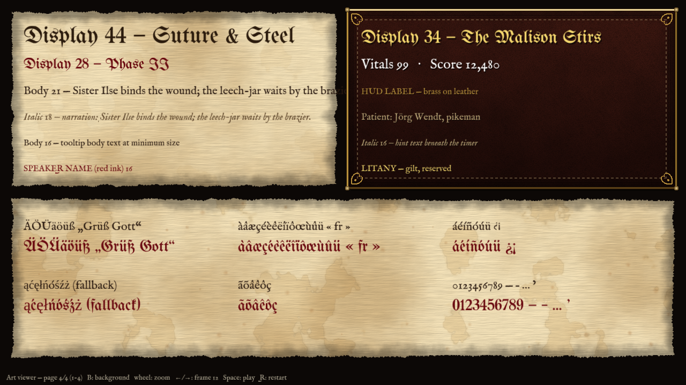

# Typography

This spec covers ART-0080, 0081, 0083 and 0084. Faces are declared in `src/render/text.ts`
(`FONT_FAMILIES`) and, per locale, in `src/i18n/fonts.ts`. All of them are OFL-1.1.

## Hierarchy (ART-0080)

| Role | Face | Minimum size (virtual px at 1280×720) | Use |
| --- | --- | --- | --- |
| `display` | UnifrakturMaguntia | 28 | Titles, chapter and phase banners, rank seals, stamps, drop caps |
| `body` | IM Fell English | 16 | Dialogue, menus, HUD numbers, tooltips |
| `italic` | IM Fell English Italic | 16 | Narration, asides, captions, hints |
| labels | IM Fell English (letter-spaced caps) | 14 | Tray labels and small HUD captions |

- Blackletter is never used for running text or for anything under 28 px. At smaller sizes it
  stops being readable.
- IM Fell SC is not shipped. Small caps are made by upper-casing IM Fell English at 0.85× size
  with +8 % tracking, which saves a font download.
- The UI text-size option (`textScale`) scales every role, and the minimums apply at 100 %.
- Line length is 60–75 characters in the dialogue scroll, with line height 1.35× the font size.
- Colours come from palette swatches only: ink `#2a1a0c` and red ink `#6a0a10` on parchment;
  brass, parchment-low and white on leather; gilt for the Litany alone.

## Contrast (ART-0081)

Every text colour and surface pair meets WCAG AA (4.5:1). `tests/unit/ui/contrast.test.ts`
checks this for each pair and for every colour filter's inks. To view every text style on its
real surface, open `?scene=artview&page=4` (the type specimen). The capture below includes the
demo languages' accented letters in both body and display faces:

## Accessibility font (ART-0083)

The Readable font option (Settings › Accessibility) switches body and italic text to
**Atkinson Hyperlegible**, an OFL-licensed face designed for low-vision readers. Titles keep the
blackletter. The parchment, ink colours and ornaments do not change, so the look holds. Art
sign-off: approved, because it is a plain face on the same materials. The shape of the
fallback does not clash with the woodcut kit.

## Glyph coverage (ART-0084)

`node scripts/art/glyph-audit.mjs` checks every shipped subset against the demo languages'
letters and punctuation:

| Face (latin subset) | EN | DE | FR | ES | PL | PT-BR |
| --- | --- | --- | --- | --- | --- | --- |
| IM Fell English / Italic | ok | ok | missing Ÿ | ok | missing ąćęłńśźż (and capitals) | ok |
| UnifrakturMaguntia | ok | ok | missing Ÿ | ok | missing ąćęłńśźż (and capitals) | ok |
| Atkinson Hyperlegible | ok | ok | missing Ÿ | ok | missing ąćęłńśźż (and capitals) | ok |

**Fallback:** Atkinson Hyperlegible latin-ext covers all 17 missing letters, and the audit fails
if that ever stops being true. For Polish, `src/i18n/fonts.ts` routes display titles to Grenze
Gotisch, a Latin Extended blackletter, and routes body text to Old Standard TT, both OFL. They
ship with the PL localisation build (LOC). Until then, the missing letters fall through to the
fallback face, and `?lqa=1` highlights them in magenta. French Ÿ appears only in proper nouns
and falls through the same way.
