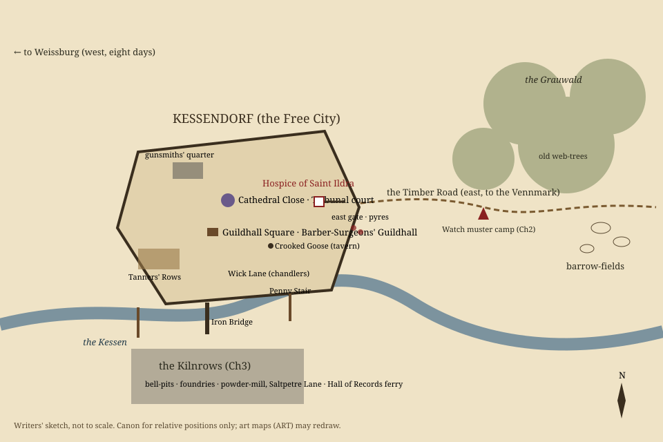

# Map sketch — Kessendorf and environs (NAR-0009)

Writers' sketch, not to scale: canon for **relative positions and travel times**, which scenes and
codex entries rely on. Codex entries reference places by the ids below (`src/content/codex.ts`).

| Place | Codex id | Where | Travel from the hospice | Scenes |
|---|---|---|---|---|
| Hospice of Saint Ildra | `place.hospice` | Inside the walls by the **east gate** | — | Prologue–s1-end, s3-*, s5-1, s5-9 |
| East-gate pyres | `place.kessendorf` | Just outside the east gate, on the Timber Road | a few minutes | Prologue (smoke), s5-3 (the sentence) |
| Tanners' Rows | `place.kessendorf` | South-west, against the wall and the river | quarter of an hour | s1-4, s5-6 |
| Gunsmiths' quarter | `place.kessendorf` | North-west, by the proof-house | quarter of an hour | s1-3 |
| The Crooked Goose | `place.kessendorf` | Guildhall Square end of the Penny Stair | ten minutes | Prologue, s5-end |
| Cathedral Close, Tribunal court | `place.ash-tribunal` | City centre | ten minutes | s5-2, s5-3, s5-5, s5-9b…s5-12 |
| Guildhall of the Barber-Surgeons | `place.kessendorf` | Guildhall Square | ten minutes | s3-9, s3-10 |
| Penny Stair, Wick Lane | `place.kessendorf` | South, down to the river | a quarter-hour | s3-6, s5-7 |
| Iron Bridge and the Kilnrows | `place.kessendorf` | Across the Kessen, south | half an hour (when the bridges are down) | s3-3…s3-8 |
| Timber Road | `place.grauwald` | East from the gate into the Grauwald | — | s1-2 (caravan), s2-1 |
| Watch muster camp | `place.grauwald` | Timber Road, **three leagues east** (half a day's march) | half a day | Chapter II |
| The Grauwald, old web-trees | `place.grauwald` | Forest north and east of the road | a day | s2-1, s2-3 |
| Barrow-fields | `place.barrow-fields` | South-east of the Grauwald, beyond the camp | a day | s2-1 (gravehound), s2-4 (the cantor) |
| Vennmark marches | — (Ch4 codex) | Four days east along the Timber Road | four days | Chapter IV |
| Weissburg | `person.kreuzer` | Eight days west; Kreuzer's guild city | eight days | Prologue, s3-9 |
